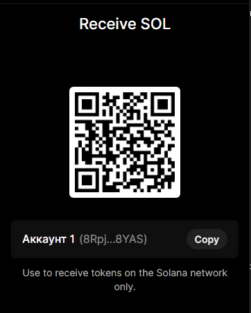

*If this research helped you, please consider giving it a ⭐ Star.*

## 🚀 Stay Updated
Found this research useful?
* **Star ⭐** this repo to keep track of it.
* **Follow me** on GitHub for more DeFi security research.
* **Fork** it if you want to run your own experiments.

### ☕ Support the Research
If you appreciate the work and want to support further security research:

**Wallet Address (ETH/EVM):**0xBDDD7973D0DE27B715A4A5cbdb87d0DF78757b3A 

**Solana:**8RpjaJQmCrRvKHMXA5ak4CrrLNJnJionwxMfTRG8YAS

Solana Trading Bot (Pump.fun Edition)
A completely rewritten and optimized trading bot for the Solana network. The bot is designed for ultra-fast token sniping on the Pump.fun platform, utilizing Jito MEV to guarantee transaction execution.

🚀 What's New?
The code has been completely overhauled to ensure maximum speed and reliability:

Jito MEV Integration: Direct transaction submission via the Jito Block Engine, enabling the bypassing of Solana's congested mempool.

Optimized Worker: Built-in background process for updating block hashes (at a 2000ms interval), eliminating RPC delays.

Transaction Security: An automated system for creating Associated Token Accounts (ATAs) and protecting against "missed shots" has been implemented.

Stability: Critical RPC timeout errors and mutex conflicts occurring during concurrent token processing have been resolved.

🛠 How to Get Started
1. Installation
Bash
git clone https://github.com/rdin777/solana-trading-bot
cd solana-trading-bot
npm install

2. Configuration
Create an `.env` file in the root directory and specify the required parameters:

RPC_URL: It is recommended to use Helius or Triton for stable operation.

* `RPC_URL`: **Note:** It is highly recommended to use a **paid Helius plan** (or a similar premium RPC service).
  * *Why this matters:* Free RPC nodes have strict rate limits that will result in `429 Too Many Requests` errors during sniping. A paid plan ensures the necessary speed (Requests Per Second) for instantaneous transaction processing.
  
* `WALLET`: Your private key (in JSON array format).
* `JITO_TIP`: The tip amount for the validator (recommended: `0.002` SOL).
* `AMOUNT`: The amount of SOL to purchase.
* `SLIPPAGE`: The allowable slippage (in %).

Why this is critically important for the bot:
RPS (Requests Per Second) Limit: The sniper bot executes a series of parallel requests: fetching the block hash, auditing the manifest, and submitting the transaction. On the free Helius tier, the limit is often set at 10–100 requests per second. The moment a new token launches on Pump.fun, the bot can exceed this limit within just 1–2 seconds, causing the node to temporarily "ban" it.

Mempool Priority: Paid RPC nodes from Helius or Triton maintain direct connections with leading validators. Your transaction will be included in a block significantly faster than if it were submitted via a public gateway.

No 429 Errors: "Too Many Requests" errors in your bot's logs indicate that the RPC node is temporarily "cutting you off." A paid plan raises these limits to levels that allow your bot to operate without interruption.

The good news: Even the most basic paid Helius plan (typically costing around $50–$100/month) pays for itself with just a single successful trade, as you stop wasting time on RPC disconnects and losing out to competing bots.

WALLET: Your private key (in JSON array format).

JITO_TIP: The tip amount for the validator (0.002 SOL is recommended for high priority).

AMOUNT: The amount of SOL to spend on purchasing a single token.

SLIPPAGE: The maximum allowable slippage (in %).

3. Launching
To manage the process, we recommend using PM2:

Bash
# Project Build
npx tsc

# Launching the Bot
pm2 start bot.js --name solana-bot

# Real-time log viewing
pm2 logs solana-bot

💡 Important Recommendations
Balance: Ensure that your wallet holds sufficient funds (> 0.15 SOL) to cover Jito tips, account rent, and the purchase itself.

Security: Never share your private key file. Add it to your `.gitignore`.

Testing: Run the bot initially with a small balance to verify that the settings are correctly configured for your RPC.

Support

### ☕ Support the Project
If this bot helped you earn money or save time on infrastructure setup, you can support our continued development and optimization.

Your donations go towards Helius subscriptions, testing new sniping strategies, and feature development.

**SOL Address:** 8RpjaJQmCrRvKHMXA5ak4CrrLNJnJionwxMfTRG8YAS

Even a small amount of support motivates us to roll out new features faster!
Why this works:
Transparency: You demonstrate that the bot isn't just a "quick hack," but a tool that requires funding for RPC nodes.

Loyalty: Users who take trading seriously understand that high-quality software comes at a cost, and they are happy to "buy the developers a coffee."

Motivation: When you see donations coming in, you feel a much stronger incentive to fine-tune and implement new features—such as automated selling via Take Profit or integration with a Telegram bot for notifications.
